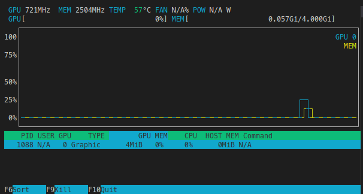

# rust-bert example

This is little example that uses the awesome crate [rust-bert](https://github.com/guillaume-be/rust-bert) to calculate the [sentence similarity](https://huggingface.co/tasks/sentence-similarity) between two string sentences.

We can open this project with [Visual Studio Code Remote - Containers](https://code.visualstudio.com/docs/remote/containers).

The docker image generated can take advantage of GPU inference if you host os has properly installed [NVIDIA Container Toolkit](https://docs.nvidia.com/datacenter/cloud-native/container-toolkit/overview.html). Make sure you have installed the NVIDIA driver for your Linux distribution before installing the NVIDIA Container Toolkit.


## Dockerfile

Take a look on how we can create an image with minimal dependencies using the two stages in [Dockerfile](./Dockerfile)

In the first stage we simply build a binary file.

In the second stage, we just copy relevant files and dependecies from builder.


## Dev Container

In order to build and test docker images we will add the [Docker-In-Docker](https://github.com/microsoft/vscode-dev-containers/blob/main/script-library/docs/docker-in-docker.md) feature


```json 
// .devcontainer/devcontainer.json
	"runArgs": [
		"--gpus",
		"all",
		"--cap-add=SYS_PTRACE",
		"--security-opt",
		"seccomp=unconfined"
	],
    ...
	"remoteUser": "vscode",
	"features": {
		"docker-in-docker": "20.10",
		"git": "os-provided",
		"git-lfs": "latest"
	}

```


```dockerfile
# .devcontainer/Dockerfile 
FROM quay.io/brainblock/rust-torch-cuda116

ARG USERNAME=vscode
ARG USER_UID=1000
ARG USER_GID=$USER_UID

# adding contrib and non-free
RUN sed -r -i 's/^deb(.*)$/deb\1 non-free/g' /etc/apt/sources.list &&\
    sed -r -i 's/^deb(.*)$/deb\1 contrib/g' /etc/apt/sources.list

# adding nvidia container toolkit deps sources
RUN distribution=$(. /etc/os-release;echo $ID$VERSION_ID) \
      && curl -fsSL https://nvidia.github.io/libnvidia-container/gpgkey | gpg --dearmor -o /usr/share/keyrings/nvidia-container-toolkit-keyring.gpg \
      && curl -s -L https://nvidia.github.io/libnvidia-container/$distribution/libnvidia-container.list | \
            sed 's#deb https://#deb [signed-by=/usr/share/keyrings/nvidia-container-toolkit-keyring.gpg] https://#g' | \
            tee /etc/apt/sources.list.d/nvidia-container-toolkit.list

# adding vscode user and tools (sudo, nvtop and nvidia-docker2 plugin)
RUN groupadd --gid $USER_GID $USERNAME \
    && useradd --uid $USER_UID --gid $USER_GID -m $USERNAME -s /bin/bash \
    && apt-get update \
    && apt-get install -y nvidia-docker2 nvtop sudo \
    && echo $USERNAME ALL=\(root\) NOPASSWD:ALL > /etc/sudoers.d/$USERNAME \
    && chmod 0440 /etc/sudoers.d/$USERNAME

```

## Build the docker image

In order to run the project and properly create the docker image, we need to download the langualge model that will be loaded from a local directory:

```bash
$ mkdir models
$ git lfs install
$ git -C models clone https://huggingface.co/sentence-transformers/all-MiniLM-L12-v2
```


```bash
$ docker build . -t example-bert
```


## Run
```bash
$ docker run --gpus=all example-bert "I'm happy" "I'm filled with happiness"
["/rust-bert-example", "I'm happy", "I'm filled with happiness"]
0.73572713
```


 


